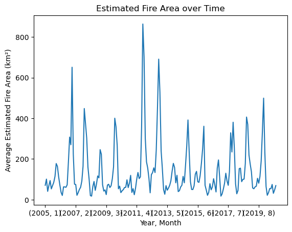

# Australia Wildfires Analysis
Analyze historical wildfire patterns across Australia to understand environmental trends, contributing factors, and regional impacts using satellite-derived fire activity data.

## Project Description
This project explores wildfire data in Australia from 2005 onward, focusing on fire area, radiative power, brightness, and confidence levels across seven regions. The analysis aims to uncover spatial and temporal fire patterns and the environmental conditions that influence wildfire activity.

## Installation
Required packages can be installed using:

```bash
pip install pandas numpy matplotlib seaborn geopandas folium
```

## Dataset
**Source:** NASA Earthdata FIRMS - [Dataset Link](https://earthdata.nasa.gov/earth-observation-data/near-real-time/firms/c6-mcd14dl)  
This dataset includes daily measurements of fire activity with confidence scores above 75%, broken down by Australian region. Key variables include:

- **Region**: One of seven geographical regions in Australia  
- **Date**: Daily entries in UTC  
- **Estimated_fire_area**: Sum of estimated fire areas (km²) per day  
- **Mean_estimated_fire_brightness**: Daily average fire brightness (Kelvin)  
- **Mean_estimated_fire_radiative_power**: Daily mean radiative power (Megawatts)  
- **Mean_confidence / Std_confidence / Var_confidence**: Statistical measures of fire detection confidence  
- **Count**: Number of fire-flagged pixels per day  
- **Replaced**: Indicator whether higher-quality data replaced preliminary records


## Methodology
- Cleaned and preprocessed data to handle missing values and ensure regional consistency  
- Explored variable correlations (e.g., brightness vs. area, radiative power vs. pixel count)  
- Visualized regional fire patterns using folium and geopandas  

## Insights
- This plot represents that the estimated fire area was on its peak after 2011, April and before 2012. You can verify on google/news, this was the time of maximum wildfire hit in Austrailia



To understand the distribution of estimated fire brightness across regions: 


  
- The following graph shows a strong correlation with mean radiative power and mean confidence


- Visualizing geospatial data on the folium map allows analyses and visualizations on the world map


## Conclusion
In conclusion, this project helped me understand and apply feature encoding, visualizing data with various graphs, and visualizing location data using folium to crate informative plots. 

## Future Work
- Build machine learning models to predict high-risk days and regions  
- Analyze long-term environmental and ecological effects of recurrent wildfires  

